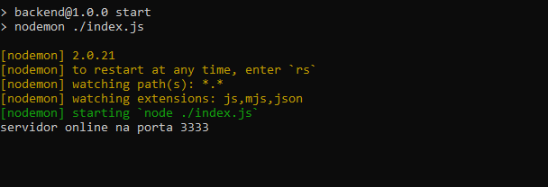

# Lab 365 - Floripa Mais Tec

## Exercícios da semana 6

### Screenshot



### Built with

- Node
- Express
- MVC Architecture

### Solved exercises

- [M1S06] Ex 3 - Iniciando um servidor Node
    Inicie um servidor node local em sua máquina utilizando express.

    O resultado esperado é imprimir na tela do navegador uma mensagem da sua escolha.

- [M1S06] Ex 4 - Rotas com express
    Crie uma rota HTTP com express para simular o envio do seu nome como parâmetro da url e imprima em um console.log() a mensagem “Rota de API criada pelo(a): {nome}”;

    OBS: substitua o {nome} pelo nome que é passado como parâmetro da url.

    OBS: utilize a plataforma de API que você preferir.

- [M1S06] Ex 5 - Rotas com express
    Crie uma rota HTTP com express para simular o envio de um objeto pelo corpo da requisição e como resposta retorne esse objeto no formato json padrão.

    OBS: utilize a plataforma de API que você preferir.

- [M1S06] Ex 6 - Criando uma API (parte 1)
    Você foi convocado para criar uma API completa, levando todo o conhecimento aprendido, incluindo a arquitetura vista no slide Aula 01 página 09, crie duas rotas HTTP: uma para o envio de um novo usuário para o banco de dados, e outra para deletar o usuário.

    Apenas crie a conexão do servidor node e as rotas em arquivos separados.

    Não será necessária a implementação das funcionalidades;

- [M1S06] Ex 7 - Criando uma API (parte 2)
    Agora continuando o exercício anterior no módulo de controlador siga as seguintes regras de negócio de cada rota:

    Envio de um novo usuário:

    O objeto a ser enviado no corpo da requisição para controlador deve seguir o seguinte formato :
    ``` JS 
    {
    "nome":"Fulano",
    "idade":18,
    "cargo":"junior"
    "senha":"12345678"
    }
    ```
    O método HTTP será o post com a rota da sua escolha;
    Caso o usuário tenha idade menor que 21 anos não deverá prosseguir com a requisição, então retorne o objeto {“mensagem”: “Usuário não possui idade suficiente”};
    Caso na requisição não seja enviado nada no seu corpo retorne com status 406 com o objeto {“mensagem”: “Está faltando dados para concluir a operação”};
    Caso a operação seja um sucesso, retorne com status 200 o objeto {“mensagem”: “Criado com sucesso”};
    Deletar o usuário:

    Deverá ser passado na URL da requisição um id;
    Verifique na url se o id é passado, caso contrário retorne com status 406 com o objeto {“mensagem”: “Está faltando dados para concluir a operação”};
    Caso a operação seja um sucesso, retorne com status 200 o objeto {“mensagem”: “Deletado com sucesso”};
    OBS: lembre de alterar os dados para que passe em todos os testes e sua API esteja 100%.

    *lista de usuários para teste*
    ```JS
    const listaDeUsers = [
        {id: 1, nome: "Arthur"},
        {id: 2, nome: "Breno"},
        {id: 3, nome: "Clovis"},
        {id: 4, nome: "Daniel"}
    ]
    ```

- [M1S06] Ex 8 - Criando uma API (parte 3)
    Agora para deixar nossa aplicação do exercício anterior mais completa, na rota de Envio de um novo usuário adicione um middleware que irá capturar o cargo do usuário. Só poderá prosseguir para a seguinte função se o cargo do usuário for igual a string “líder”.

    Lembre-se: um middleware é uma função que fica antes da chamada para o controlador ou antes da função da rota.

### How to test

`localhost:3333/`

### Available routes for testing

```JS
'/', //index
'/devs', //retorna um array
'/rota/:nome', //retorna a string "Rota de API criada pelo ${nome}"
'/enviaObj', //recebe um objeto no body da requisição
'/envia-user', //recebe um user no body da requisição
'/deleta-user/:id', //deleta um usuário pelo id
'/verifica-idade' //verifica se o usuário tem idade < 21
```
